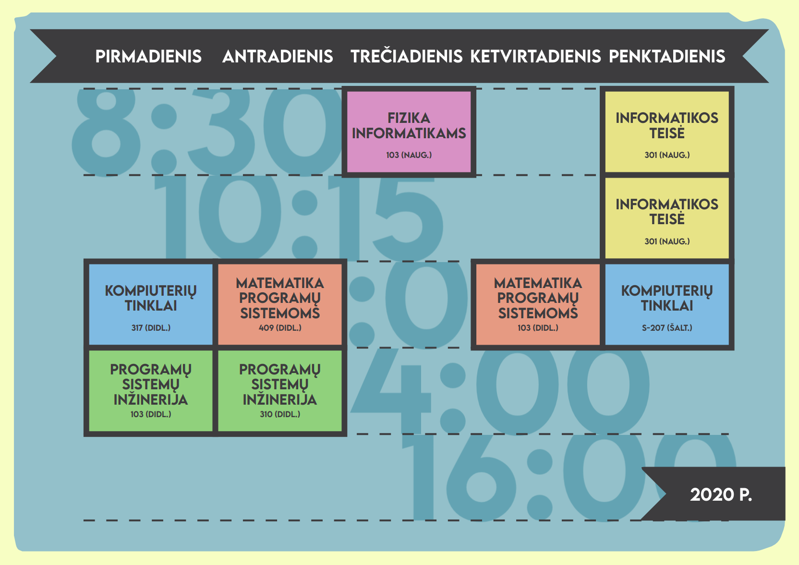

# Timetable SVG Generator

Try it out: https://pauliussasnauskas.github.io/timetable-maker/

- Clone repo
- Open `index.html`
- Customize to your needs
- Save SVG

You might need to [install the font](./LEMONMILK-Medium.otf) for SVG preview to work.

Sample:

## Credits

Font - [Lemon/Milk](https://blog.marsnev.com/2017/03/font-lemonmilk.html)
